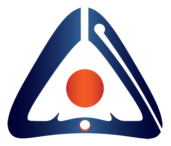

  
   

  <h3><b>Portfolio</b></h3>

# 📗 Table of Contents

- [📖 About the Project](#about-project)
  - [🛠 Built With](#built-with)
    - [Tech Stack](#tech-stack)
    - [Key Features](#key-features)
  - [🚀 Live Demo](#live-demo)
- [💻 Getting Started](#getting-started)
  - [Setup](#setup)
  - [Prerequisites](#prerequisites)
  - [Install](#install)
  - [Usage](#usage)
  - [Run tests](#run-tests)
  - [Deployment](#deployment)
- [👥 Authors](#authors)
- [🔭 Future Features](#future-features)
- [🤝 Contributing](#contributing)
- [⭐️ Show your support](#support)
- [🙏 Acknowledgements](#acknowledgements)
- [❓ FAQ (OPTIONAL)](#faq)
- [📝 License](#license)

# 📖 [Portfolio] 

> Here you find some useful information about the project

**Portfolio** is a portfolio website template that you can use to
show your skills, experience, tools, and projects

## 🛠 Built With 

### Tech Stack 

  
HTML

  <ul>
    <li><a href="https://www.w3schools.com/html/">React.js</a></li>
  </ul>

  
CSS

  <ul>
    <li><a href="https://www.w3schools.com/CSS/">Express.js</a></li>
  </ul>

ESLint

  <ul>
    <li><a href="https://eslint.org/">ESLint</a></li>
  </ul>

### Key Features 

> features of the application.

- **GitHub-workflow**
- **Linter**
- **HTML & CSS**

(<a href="#readme-top">back to top</a>)

## 🚀 Live Demo 

> the link to the live portfolio.

- [Live Demo Link](https://alpanna-gh.github.io/Portfolio/)

(<a href="#readme-top">back to top</a>)

## 💻 Getting Started 

> Describtion of how a new developer could make use of this project.

### Prerequisites

NO Prerequisites needed for this project

### Setup

Clone this repository to your desired folder:

### Install

NO installation required

### Usage

You can use it as a template for your own Portfolio

### Run tests

To run tests:
Just check for linter, GH-workflows & lighthouse

### Deployment

No deployment required

(<a href="#readme-top">back to top</a>)

## 👥 Authors 

> Collaborators of this project.

👤 **Author**

Ahmed Alpanna
- GitHub: [@github](https://github.com/ALPANNA-GH)
- Gmail: [@gmail](mailto:alpanna@gmail.com)

(<a href="#readme-top">back to top</a>)

## 🔭 Future Features 

> Some future features gonna be added soon

- [ ] **Javascript**
- [ ] **ReactJs**

(<a href="#readme-top">back to top</a>)

## 🤝 Contributing 

Contributions, issues, and feature requests are welcome!

Feel free to check the [issues page](../../issues/).

(<a href="#readme-top">back to top</a>)

## ⭐️ Show your support 

> Write a message to encourage the Author to continue development

If you like this project your comments, messeges, and support are welcome.

(<a href="#readme-top">back to top</a>)

## 🙏 Acknowledgments 

> to everyone who inspired my codebase.

I would like to thank all the reviewers who guid me through this project ...

(<a href="#readme-top">back to top</a>)

## ❓ FAQ (OPTIONAL) 

> questions that new developers may ask.

- **Can I use it as a template for my protfolio?**

  - yest you can use it, edit it and distribute it.
  - don't forget to change the information inside. :smile:

- **how to edite it ?**

  - if you know html & css you can easily edit it with any editor

(<a href="#readme-top">back to top</a>)

## 📝 License 

This project is under [MIT](./LICENSE) licensed.

(<a href="#readme-top">back to top</a>)

